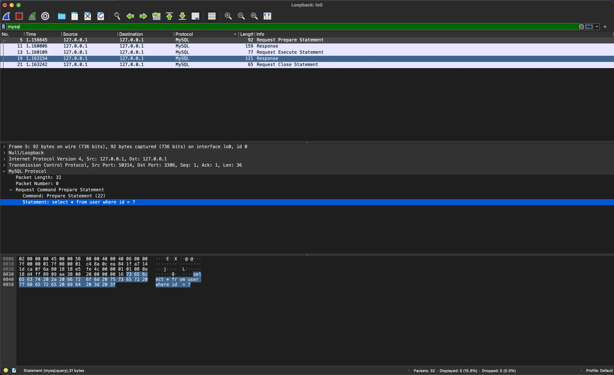

大部份的 PHP 開發者都會告訴你：用 PDO 取代 `mysqli` 相關函式，它不僅支援 [Prepared Statement](https://en.wikipedia.org/wiki/Prepared_statement)，而且還有多種 Driver 可以隨時切換不同的 Database。

<!--truncate-->

## PDO Prepare 的使用

```php
<?php

try {
    $dbh = new PDO(
        'mysql:host=127.0.0.1;dbname=test;charset=utf8mb4',
        'root',
        'root'
    );

    $sth = $dbh->prepare('SELECT * FROM `users` WHERE `role` = ?');
    $sth->bindValue(1, $_GET['role']);

    $result = $sth->execute();

    var_dump($result);
} catch (PDOException $exception) {
    die("Something wrong: {$exception->getMessage()}");
}
```

常識告訴我們，如果打算把使用者輸入（包括但不限於 `$_GET`, `$_POST`, `$_COOKIE`, `$_SERVER`，甚至是 `$_SESSION`）放進 SQL Query 中，用 `prepare` 才是標準的做法。

> 註：有一些[教學文](https://web.archive.org/web/20171107192133/https://blog.csdn.net/hornedreaper1988/article/details/43520257)也提到，請不要再用 `mysql(i)_real_escape_string` 來防止 SQL Injection，但我對此抱持懷疑態度。

而有許多的教學文章或書籍，也告訴你如果使用 `prepare` 的時候，如果相同的 SQL Statement 將被執行多次，其效能會提升：因為 SQL Statement 先轉化為樣板（template），之後再對其賦值（assignment）。

### 實際上 PDO Prepare 的底層行為

然而，這一切其實都是假象。在預設設定下，如果使用的是 MySQL Driver（或 Postgres Driver），PHP 的 `prepare` 其實只是在綁定值之前對該值做 `mysql(i)_real_escape_string`，而不是依照預期的會對 Database 先做 Request Prepare Statement 後再做 Prepare Execute Statement。

這是因為 PHP 為了避免部份 Database 或 Driver 不支援 Prepared Statement，於是在預設情況下採用「模擬」的方式，進而假裝自己是使用 Prepared Statement。

另一方面，據 [ProxySQL](https://github.com/sysown/proxysql) 的 contributor [renecannao](https://github.com/renecannao) 在 [ProxySQL #1118](https://github.com/sysown/proxysql/issues/1118#issuecomment-319585127) 所述，SQL Level 的 Prepared Statement 是相當影響效能的。

順帶一提，如果使用的是 `mysqlnd` 的 Driver （不使用 PDO 的情況下），它們底層是屬於 Binary Level 的 Prepared Statement，它們並不會使用模擬的方式執行 Prepared Statement。

## 實驗

以下設計了一個實驗以驗證 PDO Prepare 的底層行為

### 環境

- PHP 8.0.9
- MySQL 8.0.26 (in Docker)

### 結果

以 Wireshark 分析封包可以看到以下結果

#### Prepare 模擬（預設）


#### 關閉 Prapare 模擬




## 結論

開發者應該按照需要決定如何使用 PDO Attributes，如果會在一次的 Request 中重複使用多次相同的 SQL Query，可以考慮把模擬功能關閉。

在 Laravel 中，預設會將 `PDO::ATTR_EMULATE_PREPARES = false`，這可能會使 ProxySQL 或類似軟體出現預期外的問題，在使用時應該特別注意。