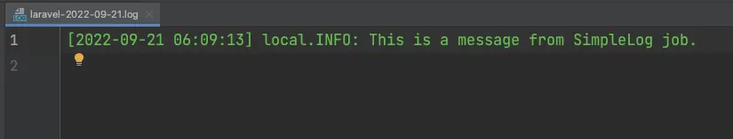
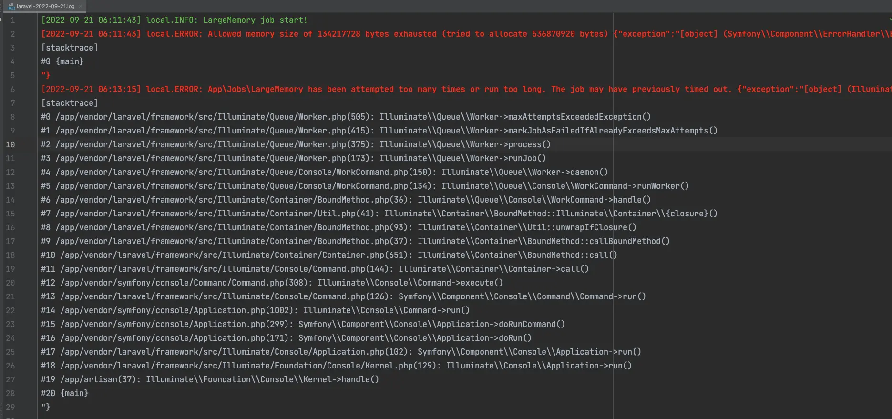
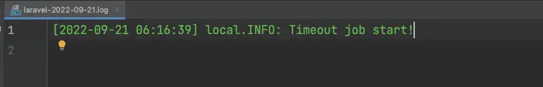
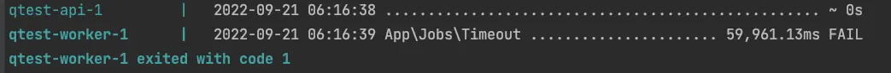
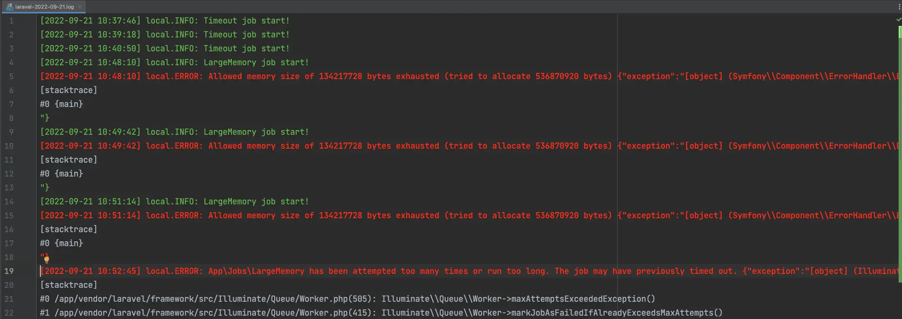

網路上有大量的文章探討**如何使用 Laravel Queue**，可惜的是，它們通常就給個 Hello World 式的範例，並未深入探討。

本篇文章會從 Laravel Queue 的實際行為上進行分析，並且著重於「失敗」的案例。

<!--truncate-->

## 前置知識

在開始今天的文章之前，我認為有必要先做一些知識性的導論，這是因為很多人對於 Queue 有著太多美好、不切實際的想像。

### 應用場景

普遍而言，Laravel 的 Queue 有兩點應用場景：

- 異步：一些耗時的場景（例如寄發 Email、影音編碼等），為了避免客戶端等待，將任務交給背景執行
- 重試：一些有可能失敗的場景（例如請求第三方 API），為了之後可以重試而將任務加進 Queue 中

> 註：Laravel 的 Queue 與系統設計時常見的 Message Queue 其實有一點點差異，雖然核心概念是類似的，但 Laravel 高昂的啟動成本使其注定不適合拿來做高流量的「削峰填谷」用途，且 Laravel 原生的 Queue 在設計時僅考量 Laravel 客戶端的實現，並不容易被擴展其它程式語言實作中。

誠如上述，「異步」與「重試」是 Laravel Queue 的兩大核心應用，而任務本身是否「可異步」與「可重試」就是在使用前需要詳細評估的。

#### 可異步

後面的程式邏輯不會依賴該任務的執行產出

```php
// app/Jobs/FooJob.php
class FooJob
{
    public function handle()
    {
        file_put_contents(
            'avatar.png',
            $this->downloadFrom('https://www.gravatar.com/avatar/03e22b766e0f889cf9e18e78c8c59595')
        );
    }
}

// routers/web.php
Route::get('/avatar', function () {
    dispatch(new FooJob());
    return new Response(file_get_contents('avatar.png'));
});
```

上述程式中，因為 `user/avatar.png` 這個檔案是在 Job 中被下載，所以直接在次一行中以 `new Response()` 回傳並不可行（尚末確認任務是否完成，該檔案不一定存在）。

#### 可重試

重新執行程式不會造成額外的成本，而且不會有 [Side Effect](https://zh.wikipedia.org/zh-tw/%E5%89%AF%E4%BD%9C%E7%94%A8_(%E8%AE%A1%E7%AE%97%E6%9C%BA%E7%A7%91%E5%AD%A6))

```php
// app/Jobs/BarJob.php
class BarJob
{
    public function __construct(private User $user)
    {
    }

    public function handle()
    {
        $this->checkout($this->user, '123 USD');
    }
}

Route::post('checkout', function () {
    dispatch(new BarJob(user()));
});
```

上述程式中，我們假設 `$this->checkout()` 是向當前用戶結帳並收取 123 美金。

然而，因為程式缺陷或網路連線問題，導致這個行為在「扣款後」發生例外（例如送出扣款請求後，卻因為網路連線不穩導致沒有收到回應），而使整個 Job 失敗，如果此時對該 Job 進行重試，就有可能發生重複扣款的意外。

### 架構

Laravel Queue 的設計主要可以被劃分為三塊：

- Dispatcher：指派 Job
- Message Queue：傳遞 Job 資訊的中介
- Worker：實際執行 Job

```
|------------|  dispatch   |---------------|
| Dispatcher | ----------> | Message Queue |
|------------|             |---------------|
                                  |
                                  |
                             Pull | 
                                  |
                                  v
                              |--------|
                              | Worker |
                              |--------|
```

其中，Dispatcher 就是實際呼叫 `dispatch()` 的位置；Worker 則是以 `php artisan queue:work` 啟動的 Laravel Queue Worker。

> 註：共有兩種 Laravel Queue Worker 的啟動方式：`queue:work` 及 `queue:listen`
> - `queue:work` 效率較好，程式的更改不會影響已經啟動的 Worker，適合產品期使用
> - `queue:listen` 效率較差，當程式更改後，會自動重新啟動 Worker 以應對變更，適合開發期使用

Message Queue 支援多種不同的 Driver：Database、Redis、Beanstalkd 及 Amazon SQS。

值得注意的是，如果使用 `database` 作為 Queue Driver，Queue Worker 會不斷輪詢資料庫以確定是否有新的 Job，如果在本身就負載很重的系統上可能會導致資源進一步緊縮。

> 註：在 Redis Driver 也是以輪詢的方式執行 `lpop` 確定是否有新的 Job，但 Redis 執行該操作成本遠低於大部份 RDBMS 的成本，所以問題不大。

## 實驗環境

- Laravel 9.30.1

### Runtime

為了保持環境的可重複利用性，採用 Docker 與 Docker Compose 建構 Runtime 時期的容器。

```yaml
# docker-compose.yaml
networks:
  qtest:
    driver: bridge

services:

  api:
    build:
      context: .
    volumes:
      - .:/app
    ports:
      - '8000:8000'
    entrypoint: []
    command: [ "php", "artisan", "serve", "--host=0.0.0.0" ]
    networks: [ "qtest" ]


  redis:
    image: 'redis:alpine'
    ports:
      - '6379:6379'
    networks: ["qtest"]

  beanstalkd:
    build:
      context: .
      dockerfile: beanstalkd.dockerfile
    ports:
      - 11300:11300
    networks: ["qtest"]

  database:
    image: 'postgres:alpine'
    ports:
      - '5432:5432'
    environment:
      - POSTGRES_USER=postgres
      - POSTGRES_PASSWORD=password
      - PGPASSWORD=password
      - POSTGRES_DB=qtest
    networks: ["qtest"]

  worker:
    build:
      context: .
    volumes:
      - .:/app
    restart: on-failure
    command: ["php", "artisan", "queue:work", "--memory=50M"]
    networks: ["qtest"]
```

- 如果使用 `php artisan tinker` 執行 `dispatch()` ，會發生任務有時沒有辦法正常被派送的問題
    - 另外設計 HTTP API 用於指派 Jobs
- worker service 加入 `restart: on-failiure`，在 Process 意外中止時由 Docker 重新啟動
    - 在[官方文件](https://laravel.com/docs/9.x/queues#supervisor-configuration)中，Queue Worker 的重啟機制是交由 Supervisor
    - 對於容器化的應用程式而言，交給 Container Runtime 處理會更好

```dockerfile
FROM alpine

ENV PHP_PACKAGES php81 \
    php81-bcmath php81-ctype php81-dom php81-exif php81-fileinfo php81-gd php81-intl php81-mbstring php81-opcache \
    php81-openssl php81-pcntl php81-pdo php81-pdo_sqlite php81-pdo_pgsql php81-posix \
    php81-session php81-tokenizer php81-xml php81-xmlwriter \
    php81-pecl-redis
ENV DEV_SOFTWARE composer

WORKDIR /app

RUN apk update && apk upgrade && \
    apk add ${PHP_PACKAGES} ${DEV_SOFTWARE} && \
    cp $(which php81) /usr/bin/php

ENTRYPOINT ["/app/entrypoint.sh"]
```

- 使用 `alpine` 作為 Base Image 並且安裝 PHP 與相關套件的效率遠大於使用 Docker Hub 上 PHP Official Image
- 為了使用 Laravel Queue Timeout 的功能，務必要記得安裝 `php81-pcntl`
- `/app/entrypoint.sh` 就不特別佔用篇幅，主要是用來執行 Database Migration

### 應用程式設定

- 為了使用 `QUEUE_CONNECTION=database`，務必執行 `php artisan queue:table` 以建立 `jobs` 表格。
- 在本範例中使用 PostgreSQL 作為 RDBMS，記得將 `config/database.php` 中設定為 `pgsql`
- 因為使用 Docker Compose，記得將相依服務（PostgreSQL, Redis, Beanstalkd）的 Host 設為 Docker Compose 中寫的服務名稱
    - PostgreSQL: `postgres`
    - Redis: `redis`
    - Beanstalkd: `beanstalkd`

實驗過程中，會依序將 `QUEUE_CONNECTION` 設為 `database`, `redis` 及 `beanstalkd`，並且逐一分析其異同。

## 任務案例

針對 Laravel Queue，以下設計了四種任務：

- `SimpleLog`：單純寫入一行資訊到 Log 中
- `LargeMemory`：會消耗大量記憶體的操作
- `Timeout`：會超時的操作
- `Exp`：會直接丟出例外的操作

理論上來說，只有 `SimpleLog` 應該成功，其餘都應該失敗。

### SimpleLog

```php
// app/Jobs/SimpleLog.php

class SimpleLog implements ShouldQueue
{
    public function handle()
    {
        info('This is a message from SimpleLog');
    }
}
```

### LargeMemory

```php
// app/Jobs/LargeMemory.php

class LargeMemory implements ShouldQueue
{
    public function handle()
    {
        info('LargeMemory job start!');
        fwrite(
            tmpfile(),
            implode(', ', range(0, 10_000_000)),
        )
        info('LargeMemory job end!');
    }
}
```

這個 Job 是利用 `range()` 產生超大陣列， 使其超過記憶體上限，如果 1000 萬還不夠多，可以用 1 億或 10 億。

### Timeout

```php
// app/Jobs/Timeout.php
class Timeout implements ShouldQueue
{
    public function handle()
    {
        info('Timeout job start!');
        sleep(200);
        info('Timeout job end!');
    }
}
```

Laravel Queue 的預設值中，`timeout` 為 60 秒，所以在 Job 中直接用 `sleep(200)` 毫無疑問會 timeout。

### Exception

```php
// app/Jobs/Timeout.php
class Exp implements ShouldQueue
{
    public function handle()
    {
        info('Exp job start!');
        throw new RuntimeException('Oh no! Something Wrong!');
        info('Exp job end!');
    }
}
```

### HTTP API

如果使用 `php artisan tinker` 執行 `dispatch()`，有時任務會無法正常派送，所以這邊另外設計三個 HTTP API 派送上述任務

```php
// routers/web.php

Route::get('job/simple-log', function () {
    dispatch(new SimpleLog());
});

Route::get('job/large-memory', function () {
    dispatch(new LargeMemory());
});

Route::get('job/timeout', function () {
    dispatch(new Timeout());
});
```

## 實驗結果

本次實驗，除了記憶體上限之外，其餘在 Laravel Queue Worker 的預設值下進行：

- 重試次數：0
- 最大執行時間：60 秒
- 記憶體上限：50 MB（預設值是 128 MB）

### SimpleLog



毫無疑問，`SimpleLog` 本身就是個不會出錯的任務，無論是在哪個 Queue Connection 下都能正常運行，在實驗中充當 Base Case。

### LargeMemory



一旦 `dispatch(new LargeMemory())` 後，PHP 就會丟出 Fatal Error，訊息應該大致上類似於 `Allowed memory size of 134217728 bytes exhausted (tried to allocate 536870920 bytes)`，此時 Queue Worker 會直接停止運作（依賴 Docker Compose 的 Restart Policy，它會重啟）

大約在一分半（90秒）後，會丟出另一個 Exception，訊息為 `App\Jobs\LargeMemory has been attempted too many times or run too long. The job may have previously timed out.`

為什麼是 90 秒（前後約會有 5 秒左右的誤差）呢？這是因為在 `config/queue.php` 中針對各 connection 所設定的 `retry_after` 值，在過了 `retry_after` 秒後 Queue 會重試，但因為該 Job 不應被重試（預設值），所以才會丟出 `\Illuminate\Queue\MaxAttemptsExceededException`

綜合上面幾點，這也是為什麼這種超過記憶體上限的 Job 難以 Debug 的主因，Log 裡會同時存在：

- 超過記憶體上限的錯誤
- 該任務丟出 `MaxAttemptsExceededException`

但它們之間會相隔至少有 `retry_after` 秒（預設為 90），今天是因為事件相對單純所以容易看出，若是在 Production 環境下，同時存在數百、數千個 Queue Job 時，這就會變得非常複雜而難以維護。

另一方面，任務丟出 `MaxAttemptsExceededException` 時的任務執行時間通常會在 50ms 以內（因為僅是偵測是否已到重試上限），所以開發者無法得知該任務首次開始的時間。

> 註：當 `QUEUE_CONNECTION=beanstalkd` 時，Queue Worker 會直接無視 `retry_after` 的設定，立即重試該 Job，這應該是 Laravel 的 Bug

> 註2：根據[官方文件](https://laravel.com/docs/9.x/queues#job-expiration)，如果使用 AWS SQS 作為 Queue Driver 時，也會無視 `retry_after` 的設定

### Timeout




對於任務超時，會有幾個行為：

- 任務失敗，記錄於 `failed_jobs` 中
- 中止 Queue Worker（所以必須依賴 Container 的重啟機制或 Supervisor）

> 註：根據[官方文件](https://laravel.com/docs/9.x/queues#timeout)，部份 IO Blocking 的 Process 並不會遵守 Queue Worker 所設定的 Timeout 值，這可能導致 `failed_jobs` 中記錄了某任務的失敗，但實際上它是成功的。

### Exception


如果任務中丟出 Exception：

- 任務失敗，記錄於 `failed_jobs` 中
- 相關的 Exception 會被記錄到 Laravel Log 上

單純的丟出  Exception **不會** 中止 Queue Worker。

## 重試（Retry）

在 Laravel Queue 中可以設定當任務失敗時重試，有兩種方式：

- 在 `php artisan queue:work` 中以 `--tries` 指定重試次數
- 在 Job Class 中，可以用 `public int $tries` 指定該任務的重試次數（優先權較高）

以下實驗以 `php artisan queue:work --tries 3` 指定重試三次。

### LargeMemory 與 Timeout

因為 `LargeMemory` 與 `Timeout` 任務的表現相當類似，在這邊一併討論。

與先前類似，`LargeMemory` 與 `Timeout` 兩個任務都會中止當前的 Queue Worker。並且在 `retry_after` 秒後重新排入 Queue 中再次執行。

在第三次執行後，經過 `retry_after` 秒後會丟出 `MaxAttemptsExceededException` 代表重試次數已達上限。

> 註：在 Log File 中可以看到，`LargeMemory` 會丟出的 `MaxAttemptsExceededException` 會被記錄下來，而 `Timeout` 並不會



### Exception

對於單純丟出 Exception，Queue 會立即重試，不需等待 `retry_after`（因為 Exception 丟出之後表示任務已經失敗）

## 加碼探討：Laravel Horizon

[Laravel Horizon](https://laravel.com/docs/9.x/horizon) 是一個由 Laravel 官方提供的 Queue Worker 管理套件。

除了 Dashboard 以外，Laravel Horizon 以 PHP + pcntl extension 與 Symfony Process 實現了親代行程（Parent Process）與子行程（Child Process）的架構：

```
|----------------------------------------------------|
| Horizon                                            |
|                                                    |
|   |-------------------|         |---------------|  |
|   | Master Supervisor | ------- | Supervisor    |  |
|   |-------------------|    |    |---------------|  |
|                            |                       |
|                            |    |---------------|  |
|                            |--- | Supervisor    |  |
|                                 |---------------|  |
|                                                    |
|                                                    |
|----------------------------------------------------|
```

- `php artisan horizon` 會監聽 SIGINT（Ctrl+C），在收到中止訊號時 Graceful Shutdown
- Master Supervisor（Parent Process）會去監測並管理各 child 的狀態
- Supervisor（Child Process）會互相監測其它 supervisor 的狀態
  - 實際上，Supervisor 下還有一個 Supervisor Process 用於實際執行 Queue Job，這邊為了簡化就省略說明
- Master Supervisor 與 Supervisor 都會監聽一些 POSIX 訊號，用來實作中止、重啟、暫停與繼續

也就是說，如果利用 Horizon 的話，Queue Worker 就不需要依賴 Container Restart Policy 或 Supervisord 管理重新啟動事宜，尤其遭遇會 Timeout 或 Out of Memory 的任務時。

> 註：事實上，Horizon 仍有中止的可能性，所以習慣上還是會使用合理的方式在其中止時重新啟動

在任務的執行行為上，Horizon 與原生的 Queue Worker 其實並沒有什麼不同，包括錯誤處理時都有類似的邏輯。