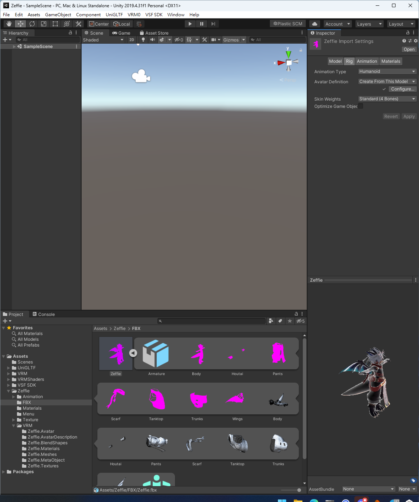
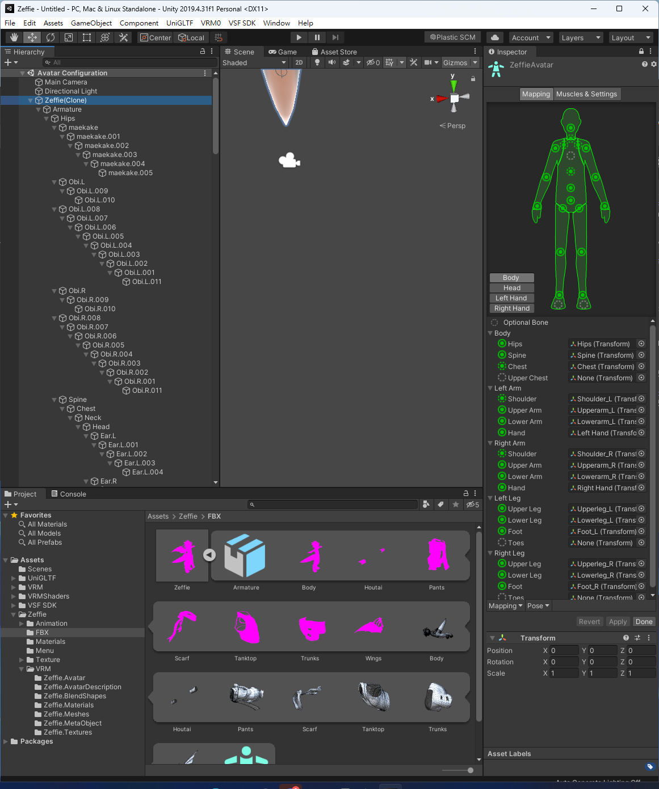
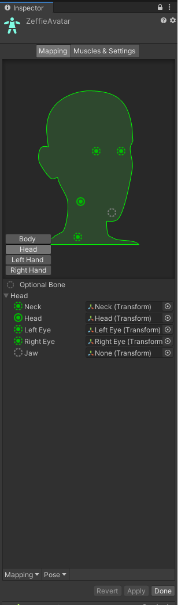
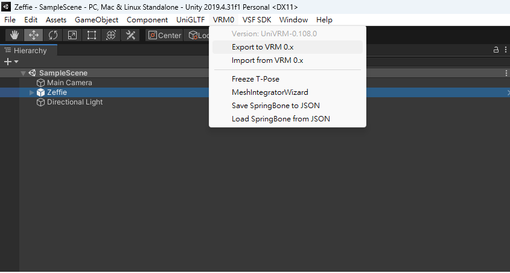
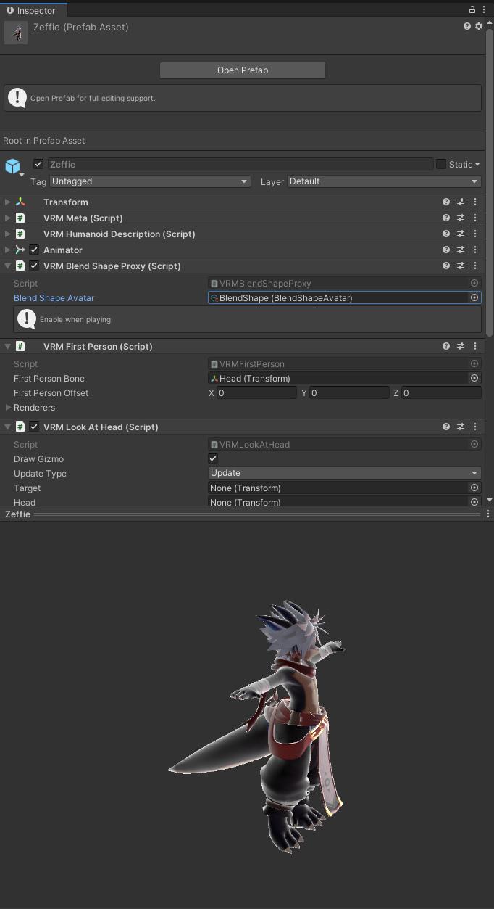
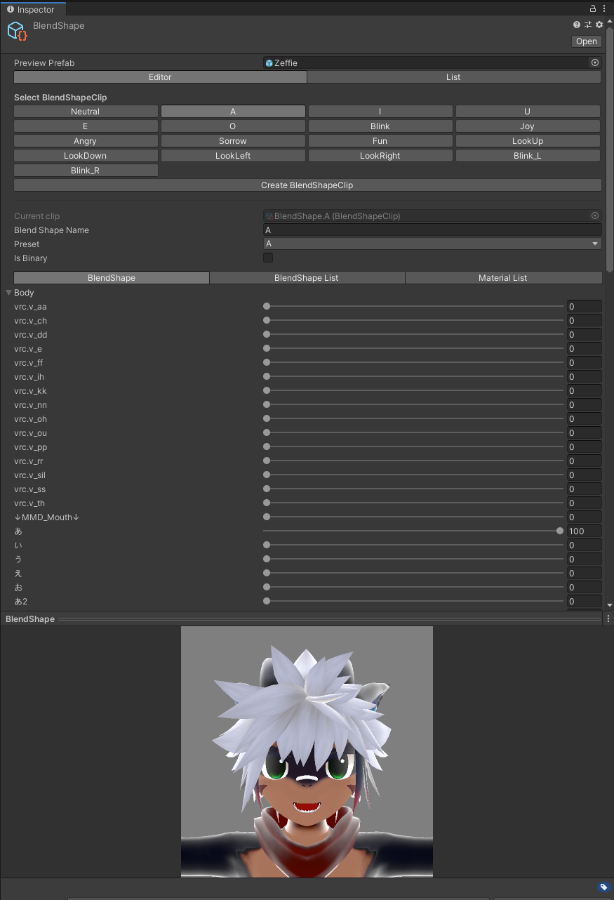
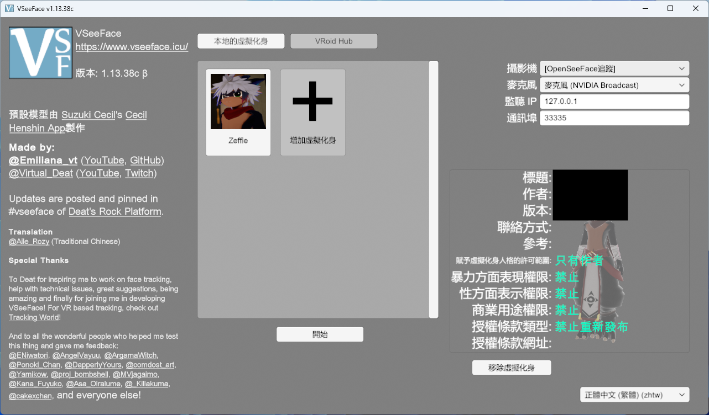
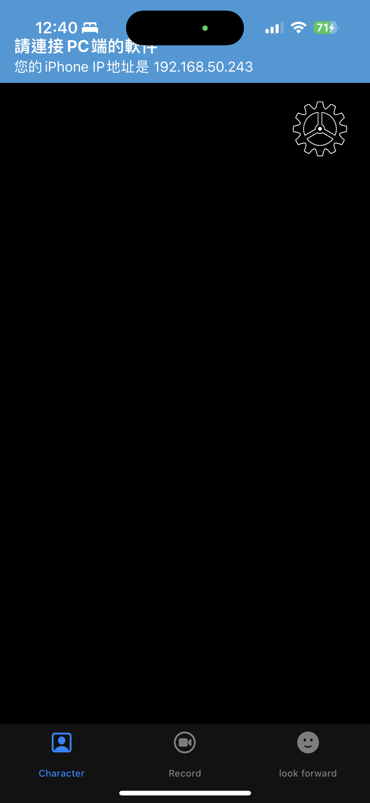
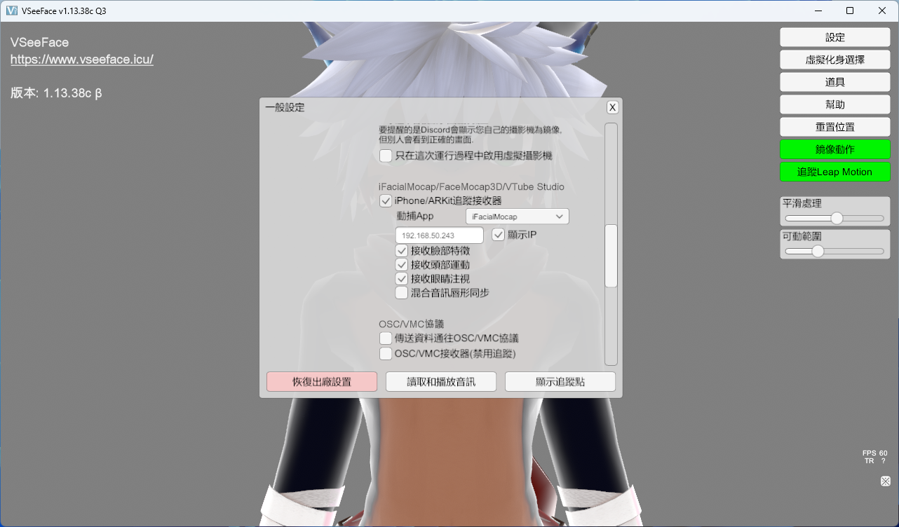

最近有嘗試著在 [Twitch 上開直播](https://twitch.tv/chivincent)，想說如果能夠讓 Zeffie（我在 VRChat 中所使用的角色形象）在直播時使用就好了。

經過一番搜索，我鎖定了 [VSeeFace](https://www.vseeface.icu/) 這套軟體，並且搭配 [iFacialMocap](https://www.ifacialmocap.com/) 做到表情捕捉。

也就是說，需要解決的問題就是：如何讓 VSeeFace 使用 VRChat 相容的 3D 模型

<!--truncate-->

## 事前準備

- [Unity 2019.4.31f1](https://unity.com/releases/editor/archive#download-archive-2019)
    - 這個 Unity 版本與 VRChat 官方的 VCC 要求是相同的
- [VSeeFaceSDK](https://github.com/emilianavt/VSeeFaceSDK/releases/tag/v1.13.38c)
- [UniVRM](https://github.com/vrm-c/UniVRM/releases/tag/v0.108.0)
    - VSeeFaceSDK 說要使用 v0.89 的 UniVRM，不過經過測試 v0.108 也是可以的
- [VSeeFace](https://www.vseeface.icu/#download)
- [iFacialMocap](https://apps.apple.com/us/app/ifacialmocap/id1489470545)
    - 如果單純想嘗試一下效果，也可以先用免費的 [iFacialMocapTr](https://apps.apple.com/tw/app/ifacialmocaptr/id1520971310)

## 流程

### 修改 Metrial

1. 因為 VRM 不支援 Zeffie 所使用 lilToon Shader，所以需要把每一個 Material Shader 都改成 `VRM/MToon`
2. 如果有需要可以加入 Outline
    - 參考教學中建議加入 0.2 的黑色線條
3. 因為我一直還沒改發光材質，所以在 Emission 的部份都先加入一個純黑色蓋過原本的設定

### 確認 FBX 的設定

在 Unity 的 Project 區域中找到原始的 FBX 檔，並且點擊 Inspector 中的 Rig 項目，將 Animation Type 改成 Humanoid

Apply 之後，點擊 Avatar Definition 的 Configure，會進到 Avatar Configuration 的畫面

在 Inspector 中點擊 Head，通常來說只有頭骨可能會需要修正。如果有顎骨（Jaw）的話，將其改為 None

完成後點擊 Inspector 中的 Done 即可回到原本頁面

### 匯出 VRM

選定 Scene 中要匯出的模型，並選釋工具列的「VRM0 > Export to VRM 0.x」

填入 Title, Version, Author 等訊息，如果想要的話也可以加入 Thumbnail（縮圖）

最後點擊 Export 選擇要儲存 VRM 的位置即可匯出，建議可以放在 `Assets/Zeffie/VRM` 之下

### 修改表情

此時的 VRM 應該可以在 VSeeFace 中使用，但可能會發現沒有表情、說話時嘴巴也不會動，這是因為模型本身尚未綁定表情到 VRM 中

在 Project 中選擇剛剛導出的 VRM，並且找到 Inspector 的 `VRM Blend Shape Proxy`，其中應該有會 `BlendShape`

雙擊後，就可以進入 BlendShape 的編輯介面，盡可能將 BlendShapeClip 的所有內容與下方 Body 的參數相對應（藉由拉動滑桿就能夠影響特定骨骼的形變，且通常 VRChat 模型都已經有一些內建的表情可以直接使用）

最後，重新發佈一次 VRM 模型，應該就可以正常在 VSeeFace 中使用這個角色模型

### 在 VSeeFace 中與 iFacialMocap iOS 連動

開啟 VSeeFace，點選增加虛擬化身，並且選擇剛剛匯出的 VRM 模型，且右邊的攝影機與麥克風先隨便選擇（如果打算使用電腦上的 Webcam 與麥克風，就要在這邊先選好）

將 iOS 設備連線到與 VSeeFace 相同的區域網路（想成是連到同一個 WiFi），再打開 iFacialMocap，它會在啟動時說明目前 iPhone 所在的 IP 位置：

在 VSeeFace 的「設定 > 一般設定」中，找到「iFacialMocap/FaceMocap3D/VTube Studio」中勾選「iPhone/ARKit追蹤接收器」，並且填入剛剛 iOS iFacialMocap 顯示的 IP 地址



## 參考資料

1. [【3d虚拟主播制作】VRM，vseeface模型文件制作环境的搭建](https://www.bilibili.com/video/BV1324y1o7UM/)