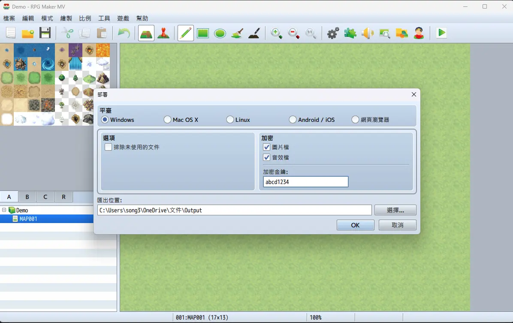

# 前言

最近在學習如何使用 Godot，並且想說嘗試著復刻一些曾經玩過的 RPG Maker 製作的遊戲作為練習。

> 註：在未獲得原始遊戲的版權所有者同意之前，請不要這麼做。

## RPG Maker MV 的加密

在 RPG Maker MV 的遊戲發佈時，開發者可以選擇用內建功能加密遊戲素材，以避免遭第三方竊取。



很遺憾地，內建的加密功能其實保護力並不高，有一些[現成的工具](https://petschko.org/tools/mv_decrypter/index.html)能夠快速將其解密。

<!--truncate-->

### 加密原理與解密方法

PRG Maker MV（有證據顯示 MZ 也是相同的方式，但我沒有購買 MZ 所以不確定），會將用戶指定的加密金鑰以 md5 運算之後儲存在 `www/data/System.json` 中，以下提到的「加密金鑰」指的都是這個經過 md5 運算之後的值

無論是對於圖片或音訊，RPG Maker 都會在加密後的檔案起始處加上 16 bytes 的識別符（第一行的位置），然後把原始檔案的前 16 bytes 用加密金鑰做 xor 運算（第二行的位置），其餘的資料與原始的檔案相同。

```
$ xxd Book.rpgmvp | more
00000000: 5250 474d 5600 0000 0003 0100 0000 0000  RPGMV...........
00000010: 68cd 1292 a209 62d0 05f6 3f84 553c 23fd  h.....b...?.U<#.
00000020: 0000 0330 0000 0270 0802 0000 00d9 4513  ...0...p......E.
00000030: 9400 0020 0049 4441 5478 daec dd87 9b23  ... .IDATx.....#
```

```
$ xxd Book.png | more
00000000: 8950 4e47 0d0a 1a0a 0000 000d 4948 4452  .PNG........IHDR
00000010: 0000 0330 0000 0270 0802 0000 00d9 4513  ...0...p......E.
00000020: 9400 0020 0049 4441 5478 daec dd87 9b23  ... .IDATx.....#
```

而大多數 PNG 檔案的前 16 bytes 又是相同的資料，所以只要把加密後的檔案前 16 bytes 刪除，然後把剩下的 16 bytes 用 PNG 的標準資料替換上去，就可以在沒有加密金鑰的情況下解密。

> 小知識：其實只要把加密後的 15 ~ 31 bytes 與 png 的檔案頭做 xor 就可以回推出加密金鑰囉，不過加密金鑰其實是明文寫在 `System.json` 裡的，所以其實也不需要這麼太費周章

## 讓 Godot 原生支援 RPG Maker 的加密格式

為了讓 Godot 能夠自動匯入 `.rpgmvp` 檔案，我們需要寫個插件。

[在 Godot 中建立新插件](https://docs.godotengine.org/en/4.4/tutorials/plugins/editor/making_plugins.html)，命名插件的進入點為 `rpg_maker_importer.gd`

在實際用插件載入之前，我們需要先實作 Image Importer：

```gdscript title="addons/rpg_maker_importer/image.gd"
@tool
extends EditorImportPlugin

func _get_importer_name() -> String:
    return "rpgmaker.image"

func _get_visible_name() -> String:
    return "RPG Maker Image"

func _get_recognized_extensions() -> PackedStringArray:
    return ["rpgmvp"]

func _get_save_extension() -> String:
    return "res"

func _get_resource_type() -> String:
    return "PortableCompressedTexture2D"

func _get_import_order() -> int:
    return 0

func _get_import_options(path: String, preset_index: int) -> Array[Dictionary]:
    return []

func _get_priority() -> float:
    return 1.0

func _get_preset_count() -> int:
    return 0

func _import(source_file: String, save_path: String, options: Dictionary, platform_variants: Array[String], gen_files: Array[String]) -> Error:
    var file = FileAccess.open(source_file, FileAccess.READ)
    if file == null:
        return FileAccess.get_open_error()
    file.call_deferred("close")

    var buf = PackedByteArray([137, 80, 78, 71, 13, 10, 26, 10, 0, 0, 0, 13, 73, 72, 68, 82])
    buf.append_array(file.get_buffer(file.get_length()).slice(32))

    return save(buf, save_path)

func save(data: PackedByteArray, save_path: String) -> Error:
	var img = Image.new()
	var err = img.load_png_from_buffer(data)
	if err != Error.OK:
		printerr("[RPG Maker Image] Failed to load PNG from buffer: ", error_string(err))
		return err
	
	var texture = ImageTexture.new()
	texture.set_image(img)

	err = ResourceSaver.save(texture, "%s.%s" % [save_path, _get_save_extension()])
	if err != Error.OK:
		printerr("[RPG Maker Image] Failed to save resource: ", error_string(err))

	return err
```

然後在插件的進入點載入剛剛實作的 Image Importer：

```gdscript title="addons/rpg_maker_importer/rpg_maker_importer.gd"
@tool
extends EditorPlugin

var image_importer: EditorImportPlugin


func _enter_tree() -> void:
    image_importer = preload("image.gd").new()
    add_import_plugin(image_importer)


func _exit_tree() -> void:
    remove_import_plugin(image_importer)
    image_importer = null
```

如此一來，把 `.rpgmvp` 檔案拖進 Godot 的時候就會自動匯入（如果插件剛寫好沒有自動處理的話，可以先 disable 再 enable，然後重新載入專案）

### 匯出檔案膨脹

如果按照上面的做法設計插件，會意外發現遊戲匯出時檔案會膨脹得離譜（我的經驗是，原本不到 200MB 的素材，匯出之後硬生生變成 4GB），這顯然是不可接受的。

檢查上面的實作，會將原始資料處理後變成 `Image` 然後再儲存為 `ImageTexture`，如果這個操作只在記憶體中有效其實倒也還好（因為實務上不會把所有的遊戲資產都一次讀入，只應該去讀需要的部份），但在匯出時會轉存為檔案就情況不同，會佔用大量空間。

因此，在轉存時應該注意使用 `ProtableCompressedTexture2D`，這樣可以比較有效地應用空間；值得注意的是，如果只是 2D 遊戲的素材，大可以直接使用 `PortableCompressedTexture2D.COMPRESSION_MODE_LOSSLESS` 的壓縮方式即可。

在純 2D 遊戲下，使用無損方式壓縮其實能保有最高的空間效率，而且現代顯示晶片應付 2D 遊戲通常是比較沒有壓力的，所以也不需要特別考慮 VRAM 效率而使用 `PortableCompressedTexture2D.COMPRESSION_MODE_BASIS_UNIVERSAL`

> 註：根據不嚴謹的個人實驗，無損的方式佔用空間大小約膨脹 10% 左右，而 basis universal 則會膨脹 3~5 倍

根據以上的研究，可以將 `image.gd` 改為

```gdscript title="addons/rpg_maker_importer/image.gd"
# ...

func save(data: PackedByteArray, save_path: String) -> Error:
    var img = Image.new()
    var err = img.load_png_from_buffer(data)
    if err != Error.OK:
        printerr("[RPG Maker Importer] Failed to load PNG from buffer: ", error_string(err))
        return err

    var tex = PortableCompressedTexture2D.new()
    tex.create_from_image(img, PortableCompressedTexture2D.COMPRESSION_MODE_LOSSLESS)

    err = ResourceSaver.save(tex, "%s.%s" % [save_path, _get_save_extension()])
    if err != Error.OK:
        printerr("[RPG Maker Importer] Failed to save resource: ", error_string(err))

    return err
```

## 結語

雖然在本文中揭露了 RPG Maker MV 中那個不太安全的加密方式與解密手段，但是我並不鼓勵個人用戶在未經同意的情況下對遊戲資源進行解包。

另一方面是，我認為遊戲開發者也不要太過執著於加密自己作品中的資產，因為這其實是成本遠高於收益的行為：畢竟最終仍會顯示在用戶端，即便上 DRM 機制最終都會需要在客戶端解密後才能顯示，為這些做過高的付出非常不值得。

## 參考資料

1. [Java RPG Maqker MV Decrypter](https://gitlab.com/Petschko/Java-RPG-Maker-MV-Decrypter)
2. [Godot Tutorial - Import Plugins](https://docs.godotengine.org/en/stable/tutorials/plugins/editor/import_plugins.html)
3. [Provide a way for Editor Import Plugins to save images as compressed textures (.ctex) #11042](https://github.com/godotengine/godot-proposals/discussions/11042)