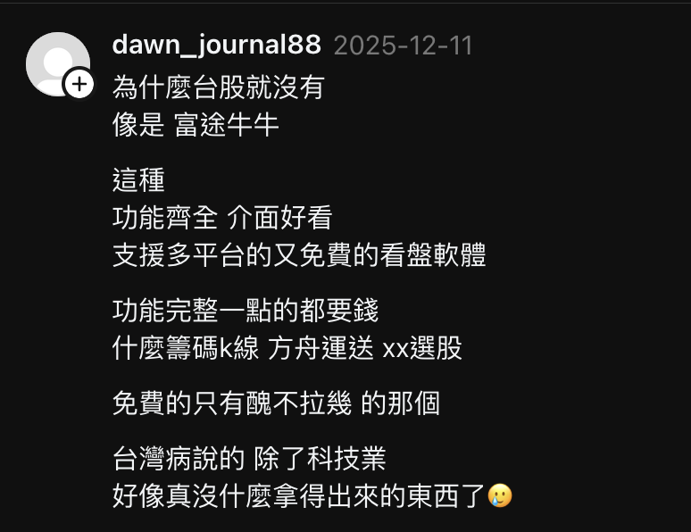
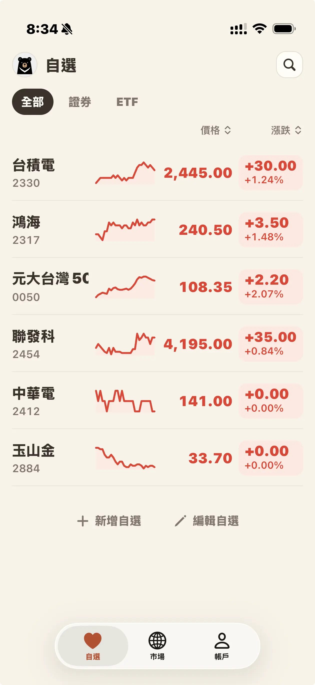
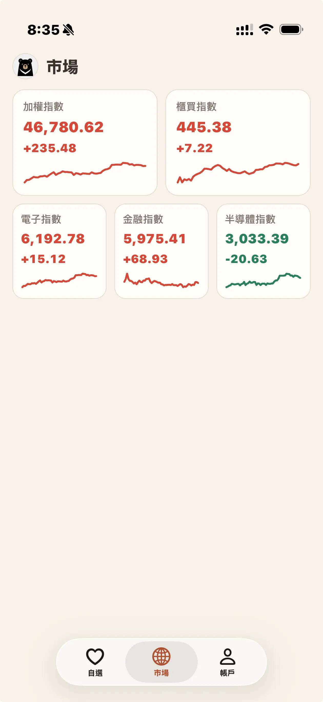
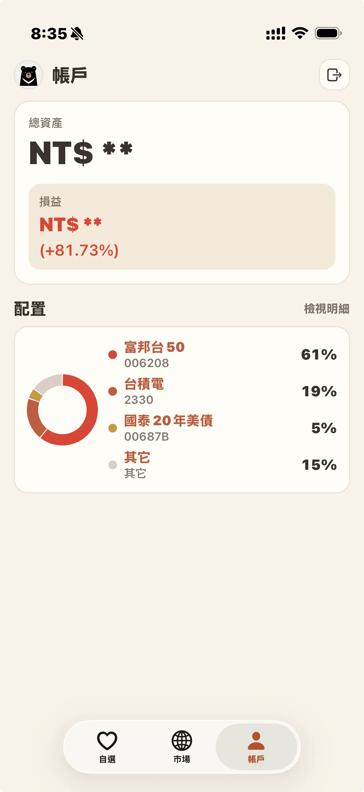

所有故事的起因，應該是源於一篇 Threads 上的文。



身為富邦證券多年的奈米投資戶，一直以來都對富邦 APPs 有著許多遺憾：
1. 富邦 e 點通：估且不提那個超 ㄅㄧㄤˋ 的 APP 名稱，APP 本身也處處充滿著只有我們這類 7、8 年級生才能理解千禧年 dreamcore，再加上我只想簡單查看未實現損益也都要點四個按鈕再滑動一下，確實也是前無古人後無來者的神奇體驗。
2. 富邦 Online：可能他們也曉得富邦 e 點通各種陳舊的 UI 實在不行，於是後來推出了「富邦 Online」，UI 是改進了但 UX 是一點沒改（個人評價是甚至還倒退了），並且隨著下面的「富邦 AI Pro」 的出現，它也算是完成了階段性的使命。
3. 富邦 AI Pro：UI/UX 有非常大的進步，但是一點進去廣告就糊在臉上的體驗確實算不上好事。其實我挺好奇，到底為什麼有些開發者這麼喜歡把廣告塞在 APP 的各角落，又不是那些不在乎名聲的中國開發者；如果說是免費 APP 也就算了，富邦證券又不缺那點廣告費，何必把自己的使用體驗與名聲賠進去呢？

<!-- truncate -->

這也是促成我開發「富台熊熊」的契機（對，這個名稱很明顯地是借鑑了「富途牛牛」）：我單純想要一個給自己用來看股票的 APP，而我的目標如下：
1. 唯讀，我不會在這上面做下單：我個人的交易量極小，只有每個月的定期定額外加偶爾跟風買一點
2. 需要連結證券帳戶，因為我習慣看未實現損益：看著那個數字每天跳動其實挺好玩的，尤其是往上跳的時候有點爽感（？）

## 設計

在設計上我用 [Open Design](https://open-design.ai/) 做視覺設計（背後使用的是 ChatGPT 5.5），我並不是專業的設計師，但對於獨立開發而言沒有其它可選項。我原本就是為了開發給自己使用，所以其實只要自己用得順手就好。

我讓 Open Design 為我設計了三個頁面：

import Tabs from '@theme/Tabs';
import TabItem from '@theme/TabItem';

<Tabs>
<TabItem value="watchlist" label="自選 Watchlist" default>



</TabItem>
<TabItem value="market" label="市場 Market">



</TabItem>
<TabItem value="account" label="帳戶 Account">



</TabItem>
</Tabs>

## 第一次開發

### 前端

我自己主業是後端工程師，但是有稍微學過一點點  React / Next.js，因此我選擇了 [Expo](https://expo.dev) 作為我應用程式的框架。

就我的理解來說，React 之於 Next.js 的關係，有點類似於 React Native 之於 Expo 的關係，而且它對 Web/iOS/Android 的多端支援，也是我選擇它的主因（但後來我也為此付出了慘痛的代價）。

將 Open Design 所做出的設計放進 `designs/` 資料夾，然後對 Codex 說：參考 designs/ 下的檔案設計介面，不需要介接任何功能，使用設計稿中的展示資料即可。

後來我考慮到降低前端的依賴（尤其是畫 K 線圖的部份）以避免供應鍊攻擊的可能性，因此我選擇使用由 Shopify 開源的 [React Native Skia](https://shopify.github.io/react-native-skia/) 來進行 2D 繪圖，在 Codex 的幫助下成果讓我挺滿意的。

然而在 SQLite 的支援上，因為 Web 的支援相對麻煩得多，因此我忍痛（？）放棄了對 Web 平台的支援，其實在寫 React Native 的時候常常就會因為某些套件的支援性而不得不對 Web 平台做出妥協，原本幻想中的「寫一次 code、多平台執行」僅限基礎功能就是。

而在後來的 SDK 串接上，堪稱是災難的開始。

### 後端篇

近年來，許多證券商提供了 SDK 讓開發者能夠介接：搭配著 Claude/Codex 這類 LLM 服務，一個完全沒有程式能力的資深股市投資者，也可以將自己的策略自動化。

其中以[永豐金證券的 Shiaoji](https://sinotrade.github.io)算是做得最好的；而富邦、台新、玉山則選擇與群馥科技合作，也推出了相關的 SDK。

然而，仔細閱讀這些 SDK 後發現，它們並不單純是 Javascript Package，而是用 Rust 寫的 FFI 去接給 Javascript 用，這導致如果他們沒有編譯相應的平台，這些 SDK 是無法直接拿到 Android 或 iOS 上使用的。

> 註：在這點上，永豐金的 Shiaoji 就做得更好，雖然他們底層也是 Rust 寫的，但是至少可以用 Shiaoji CLI 去開放 HTTP API 讓人介接

為了繞開 SDK 無法支援手機端的問題，只好寫一個 API Server 來處理這件事。（轉來轉去，又回到後端的老本行……）

我一開始的想法很簡單：建立一個 Bun Web Server，它會用 SDK 提供的 Login 方法主動維護一個 Session，當我有需要特定的功能就使用特定的 API Endpoint 調用即可。所有的 Request/Response 都依照 Javascript SDK 原封不動提供。

### 佈署篇

Javascript SDK 本身支援的環境還算全面（至少 Linux x64 跟 ARM 都支援），因此我仍可以用 GitHub Action 將它們打包成符合 OCI 標準的 Image（講人話，Docker Image），並且在大部份的平台上跑起來（實驗時用的是 Raspberry Pi，通常我是作為 Home Lab 使用），因此在後端的支援上並沒有花費太多心力。

iOS 端的部份，只要在前端專案根目錄下 `bun expo prebuild`，然後用 Xcode 打開 `ios/` 資料夾，然後交給 Xcode Build 打包就沒什麼問題；不過，花了 100USD 之後才能發 Testflight 跟送審，確實是麻煩不少。

Android 端的部份，也是在前端專案根目錄下 `bun expo prebuild`，但是需要做一大堆前置設定（例如用 `keytool` 產一個 upload key、安裝 java 環境等等），之後才能在 `android/` 資料夾內執行 `./gradlew bundleRelease`，然後才能上傳 Play Store Console。

順帶一提，Android 端還需要在 `app.json` 中設定一個 `expo.android.versionCode`（在 iOS 端則是 `expo.ios.buildNumber`），必須是一個單調遞增且不重複的值，因為覺得太麻煩了，我最後決定讓 GitHub CI 自動幫我在 Release Branch 上根據 Version Code 來生成：

假設版本號是 `v1.2.3.4`（分別對應 Play Store 中的「正式版號」、「公測版號」、「封測版號」與「內測版號」），其 `versionCose = buildNumber = 1 << 24 + 2 << 16 + 3 << 8 + 4`，這樣我就不必煩惱忘記改版號的事。

### 結局

最後，我成功上架了嗎？


首先來說說 Apple，一開始我為了讓一般人也能使用我的 App，所以架了一個免費的後端，但是連接的是富邦證券的測試用伺服器跟測試帳戶，並且在 App 內做出提醒。

而 Apple 認為這不符合他們 [Guideline 2.2 - Performance - Beta Testing](https://developer.apple.com/app-store/review/guidelines/#2.2) 的準則，因為有「測試」字眼。

後來我將它改稱為「模擬環境」後再送了一次，這次他們又認為這個 APP 並不符合 [Guideline 5.1.1(ix) - Legal - Privacy - Data Collection and Storage](https://developer.apple.com/app-store/review/guidelines/#data-collection-and-storage)，要求我重新註冊一個組織帳號或將我的個人開發者帳號升級為組織帳號才能再送。

至此，我基本上已經覺得無望，我本來就是吃飽撐著沒事才寫這個 APP 的，我都已經花了 99USD 註冊成為 Apple Developer，如果還要為此去註冊一間公司來經營它實在是非常不合算，因此我算是半放棄了在 apple 上架的事。（可惜了 Expo UI 弄了很漂亮的玻璃質感 Navigator）

至於 Android 方面，上架流程需要在封測流程中找 12 個人連續測試 14 天（感覺就是 Android 把測試人員的成本外部化，才能做到終身開發者帳號只要 25 USD），我在 Facebook 上找了一個互助社團，目前仍在進行測試流程中。（但感覺上架希望不大，反正我也是做身體健康的沒差）

後端的部份更是經歷了各種離奇的冒險，前面提到它的 Javascript SDK 是用 Rust 搭配 [NAPI-rs](https://napi.rs/) 達成 Nodejs 綁定，但是在 Rust 端開發者使用了 `Result::unwrap()` 讓出錯時產生 panic，並且讓整個 Node Process 被強制中止，另外我懷疑程式中存在 Memory Leak 問題，因為在某些操作會讓 memory usage 不斷往上噴。為了緩解後端問題，我必須使用 `docker --start=always --memory="512m"` 去強行接下這些錯誤以避免整個伺服器崩潰（前幾天我還真沒下 memory limit，導致當時 ssh 進去的時候卡得不行）

以上，是我第一次開發 Android/iOS App 的經驗，並且產出了以下產物：

- [futw-bear/futw](https://github.com/futw-bear/futw)：Expo 前端介面
- [futw-bear/rabang](https://github.com/futw-bear/rabang)：將 SDK 改成 HTTP API 的後端服務

## 第二次開發

在原本 Apple Store 上架受阻、Android 封測太麻煩、後端問題一堆，我本想放棄開發。

我本想說用 Python 重寫整個 Rabang 後端伺服器，一方面是因為大部份證券公司都只有支援 Python，帶著宏大的夢想，想說把幾家支援 Linux 的證券商 SDK 接了個遍（富邦、台新、玉山、永豐、元大）。

結果在第一站富邦就摔得個狗吃屎（？），因為資料型態是 Rust Native Type 暴露出來的，與 JS SDK 原生丟 JSON 不同，Python 必須重新介接所有參數名稱與內容，再加上我對 Python 又不熟，所以這個念頭很快就被我拋棄了；只不過在研究的過程中找到一條路徑：fork 一個 subprocess，讓它去處理跟 sdk 相關的工作，中途使用 IPC 的方式連接（或是直接做成兩個 binary，中間用 gRPC 甚至是架一個 postgres 去連接），這可以避免因為 Rust 端 panic 造成整個 Node Porcess 都被關掉的情況。

於是，浩浩蕩蕩的第二次開發，就從後端開始。

### 後端

我將 Python 中摔過的坑以及用 subprocess 處理 SDK 相關的工作的概念重新用 Javascript 寫了一次（這方面 Codex 幫了大忙，新的 5.6-Sol High 模型真的挺好用，而且每月 690NTD 的 Plus 帳號其實對我這種輕度開發是很足夠的）

並且在試驗的過程中，因為永豐的 API 與生態做得要比其它公司要好得很多，因此我試驗性地在這個專案中對永豐 API 提出支援：
- `/proxy`：表示直接調用富邦 SDK 的功能
- `/bridge`：表示模仿永豐 API 的功能，但是有些功能無法提供

如果是像我一樣只有看盤需求，我現在會使用 [Shiaoji Pro](https://sinotrade.github.io/shioaji-pro-app/) 搭配 Bridge 在桌面平台上看盤。

> 註：交易功能理論上是有問題的，因為有些交易功能無法完全支援，所以我自已是不會用 Shiaoji Pro + Rabang OSS 去下單。

最後，我打造了 [Rabang OSS](https://github.com/futw-bear/rabang-oss)，這是一個 API/SDK 聚合器。

### 前端：FUTW Web

重新思考一下，我們「真的」需要 APP 嗎？如果我們只是需要一個介面，又搭配上有 API，那我有什麼理由要重新設計一個 Android/iOS APP？

**直接用網頁不就好了**

是的，只要基於 [PWA](https://developer.mozilla.org/zh-TW/docs/Web/Progressive_web_apps) 這個技術，事實上我並不需要設計任何 Android/iOS 應用程式，就可以提供與原生 APP 類似的體驗。

我將原本的設計移過來，重新讓 Codex 生成這些介面並介接 Rabang OSS 的 API，然後感覺到自己浪費了至少兩個禮拜的時間跟 125 USD 去跑整個 Apple Store / Google Play 上架流程。（嗚嗚，我還不如花這個錢去星穹鐵道抽個姬子回家…）

最後，我打造了 [FUTW Web](https://github.com/futw-bear/futw-web)，這是一個 PWA 應用程式，你可以在 [https://web.futw-bear.com](https://web.futw-bear.com) 直接體驗它。

### 佈署

在這個應用程式中，網頁與 APP 最大的差別在於是否需要 CORS，在寫 APP 的過程中我甚至都忘記還有 CORS 這個問題，以致於在 Rabang OSS 的設計上並沒有處理它。這讓網頁在佈署時遇到的第一個問題就是請求被 CORS 擋在門外，瀏覽器拒絕使用這些請求值。

在經過一番思考，我不認為應該由後端程式來處理 CORS 問題，這些 Headers 完全可以由 Web Server 層級自動添加。（其實我以前在開發後端時就常有這個想法，但是通常 SRE/DevOps 都另有其它團隊，實在不好意思讓他們多負擔工作，因此通常都是在應用層加個 middleware 來處理）

但現在獨立開發，我完全可以讓 Web Server 來負擔這個工作。因此我在 Caddy Web Server 中寫下了以下的設定：

```
(cors) {
	@cors_preflight {
		method OPTIONS
	}

	header @cors_preflight {
		Access-Control-Allow-Origin "https://web.futw-bear.com"
		Access-Control-Allow-Methods "GET,POST,OPTIONS"
		Access-Control-Allow-Headers "User-Agent,Content-Type,Authorization"
		Access-Control-Max-Age "86400"
		Vary "Origin"
	}

	respond @cors_preflight 204

	header {
		Access-Control-Allow-Origin "https://web.futw-bear.com"
		Access-Control-Allow-Headers "User-Agent,Content-Type,Authorization"
	}
}

rabang-oss.futw-bear.com {
	import cors
	reverse_proxy localhost:4000
}
```

另外，如果我想要加上 Static Bearer Token 驗證，也完全可以在 Caddy Web Server 中做設定：

```
rabang-oss.protected-host.test {
  import cors

  @bearer_auth {
    header Authorization "Bearer my_secret_token"
  }

  handle @bearer_auth {
    reverse_proxy localhost:4001
  }

  respond "Unauthorized" 401
}
```

## 結語與未來

其實本次的開發體驗算是非常有趣的經歷（除了心疼那個浪費掉的 125USD 雙平台開發者費用之外），包括但不限於用著不夠穩定的 SDK（到底是哪個天才工程師會用 `Result::unwrap()` 來處理錯誤，還有讓 Rust 還可以寫到 Memory Leak……）

> 註：我不確定 Memory Leak 是不是 Rust 端的問題，但從 Docker Stats 上看確實有記憶體持續增長的問題，之後可能找時間逆向一下是哪邊出問題

其實也算是一個技術教訓（？）：其實早就知道 PWA 可以做到大部份的事，但就硬覺得要自行完成一個 APP 才算是圓滿。

至於未來，我其實不是很確定這個專案會不會持續下去，畢竟 Rabang OSS 與 FUTW Web 都以 GPLv3 的形式開源出去，其實我大概是賺不到錢的，而近期因為已經半年多來沒工作，確實資金上有些捉襟見肘。

因此，之後可能會先找個工作再談要不要繼續維護吧 XD。